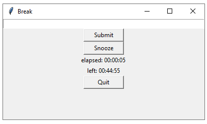

# nudge

A minimalist time tracker (to csv) and break reminder in python 3.

## Getting Started

Use `pythonw.exe` or `pythonw` to run (gui without the console).

## Functionality

* The GUI window popps up after 45 min to remind the user to take a break.
* The user can submit an activity description to `log.xlsx` (date start, date end, time delta, activity).
* The snooze button schedules the reminter to 5 min later.

## Suggestions

- Create a shortcut to the script on the desktop so that it is convenient to start the logging.
- Time-track different projects just by copy-pasting the script to a different folder (or do the renames in the scirpt).
- Modify the script as you wish.

## Author
Kristjan Krebelj

## License
This project is licensed under the GPU License - see the [LICENSE.md](LICENSE.md) file for details.